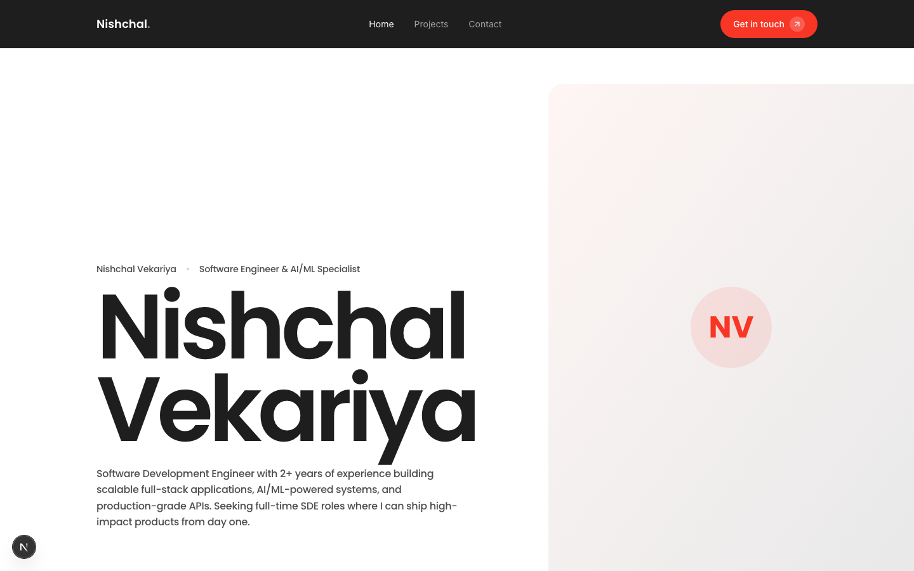
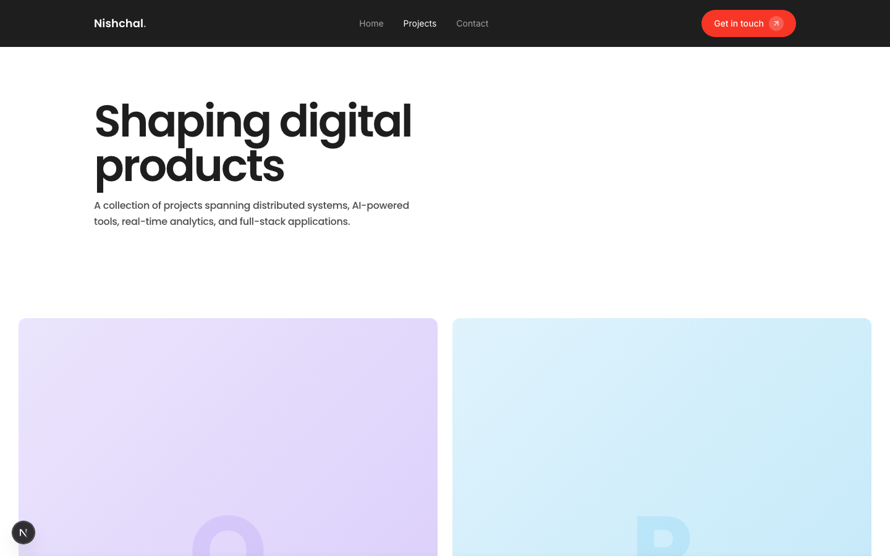
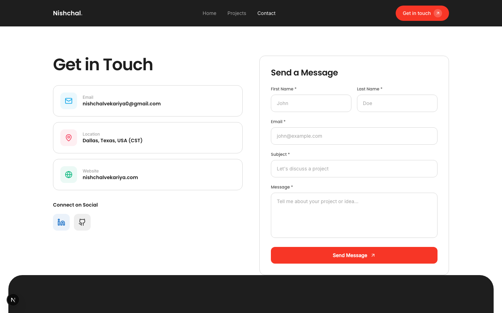

# Nishchal Vekariya — Portfolio

Personal portfolio website built with Next.js, Tailwind CSS, and Framer Motion.



## Live Demo

> Coming soon — deploying to Vercel

## Tech Stack

- **Framework:** Next.js 16 (App Router)
- **Language:** TypeScript
- **Styling:** Tailwind CSS v4
- **Animations:** Framer Motion
- **Icons:** Lucide React
- **Fonts:** Poppins + Inter (Google Fonts)

## Pages

| Page | Route | Description |
|------|-------|-------------|
| Home | `/` | Hero, About Me, Projects, Services, Skills, Contact |
| Projects | `/projects` | Grid listing of all projects |
| Project Detail | `/projects/[slug]` | Case study with sections, metadata, related projects |
| Contact | `/contact` | Contact form with info cards and social links |

### Projects Page



### Contact Page



## Features

- Scroll-triggered animations with staggered reveals
- Animated stat counters on viewport entry
- Responsive design — desktop, tablet, mobile
- Contact form with mailto integration
- Dynamic project detail pages with `[slug]` routing
- Skills section with proficiency-based color coding
- Sticky navbar with active link highlighting
- Mobile hamburger menu with slide animation

## Getting Started

```bash
# clone the repo
git clone https://github.com/Nishchal45/portfolio.git
cd portfolio

# install dependencies
npm install

# start dev server
npm run dev
```

Open [http://localhost:3000](http://localhost:3000) in your browser.

## Project Structure

```
src/
├── app/
│   ├── layout.tsx            # Root layout with fonts and metadata
│   ├── globals.css           # Design tokens, typography, spacing
│   ├── page.tsx              # Home page (all sections)
│   ├── contact/page.tsx      # Contact page
│   └── projects/
│       ├── page.tsx          # Projects listing
│       └── [slug]/page.tsx   # Dynamic project detail
├── components/
│   ├── Navbar.tsx            # Sticky dark navbar
│   ├── Footer.tsx            # Footer with CTA and links
│   ├── ProjectCard.tsx       # Reusable project card
│   └── StatCounter.tsx       # Animated number counter
└── lib/
    ├── data.ts               # All portfolio content (single source of truth)
    └── animations.ts         # Framer Motion animation variants
```

## Customization

All personal content is in `src/lib/data.ts` — profile info, projects, services, experience, education. Update that file to make it yours.

Design tokens (colors, fonts, radii, spacing) live in `src/app/globals.css`.

## Deployment

```bash
# build for production
npm run build

# or deploy to Vercel
npx vercel
```

## License

MIT
